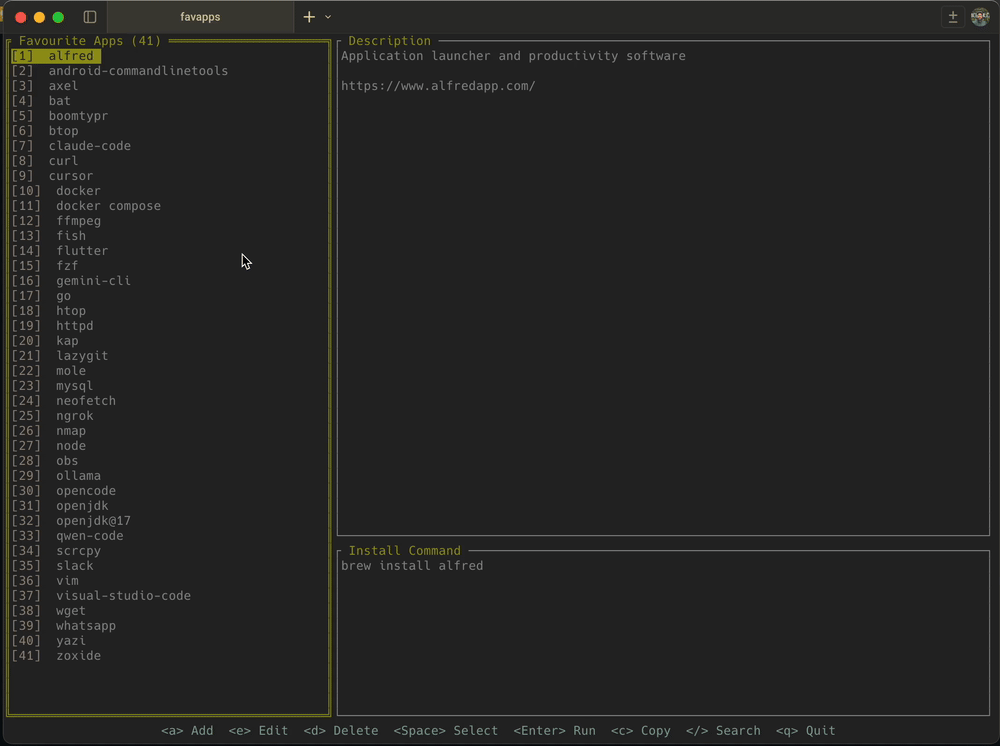

# FavApps

A terminal-based TUI application for managing and installing your favorite applications quickly. Built with [tview](https://github.com/rivo/tview) and [tcell](https://github.com/gdamore/tcell), it provides an intuitive interface to browse, search, and install apps with a single command.

## Features

- **Browse & Search**: View your favorite apps with descriptions and install commands
- **Multi-select**: Select multiple apps and install them all at once
- **Quick Install**: Run install commands directly from the TUI
- **Copy Commands**: Copy install commands to clipboard
- **CRUD Operations**: Add, edit, and delete app entries
- **Persistent Storage**: Apps are stored in JSON format
- **Configurable**: Customize the app storage path

## Installation

```bash
# Clone the repository
git clone <repository-url>
cd favapps

# Build the application
go build -o favapps .

# Run the application
./favapps
```

## Usage

| Key | Action |
|-----|--------|
| `a` | Add a new app |
| `e` | Edit the selected app |
| `d` | Delete the selected app(s) |
| `Space` | Toggle multi-selection |
| `Enter` | Run install command |
| `c` | Copy install command to clipboard |
| `/` | Search/filter apps |
| `p` | Configure app storage path |
| `Esc` | Clear selection / Reset filter |
| `q` | Quit |

## Configuration

The app stores its configuration in `~/.favapps_config.json` and app data in `.favapps/data.json` by default. You can customize the storage path by pressing `p` in the app.

## Example

```bash
./favapps
```

This will launch the TUI where you can browse your favorite apps, search for specific ones, and install them with a single keystroke.

## Technologies

- [tview](https://github.com/rivo/tview) - Rich terminal UI framework
- [tcell](https://github.com/gdamore/tcell) - Terminal cell library
- [clipboard](https://github.com/atotto/clipboard) - Clipboard access


## Demo


## License

MIT
